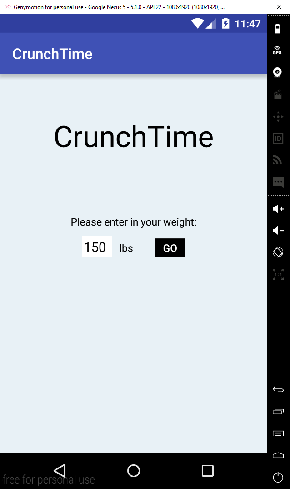
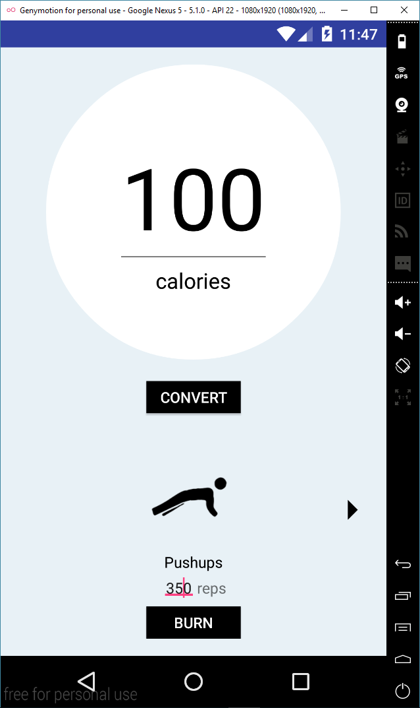
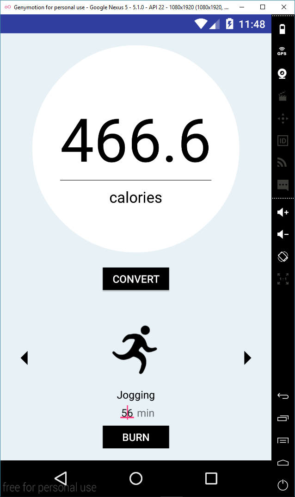

# PROG 01: Crunch Time

Crunch Time is a calorie conversion application for Android. The app allows the user to see how many calories they have burned for an amount of exercise, or how much exercise they need to burn a target amount of calories.

## Authors

Sarah Au ([sau@berkeley.edu](mailto:sau@berkeley.edu))

## Demo Video

See [CrunchTime](https://youtu.be/f58y5Fh8ZUU)

## Screenshots

## Acknowledgments

* Hat tip to anyone who's code was used
* Any other support
